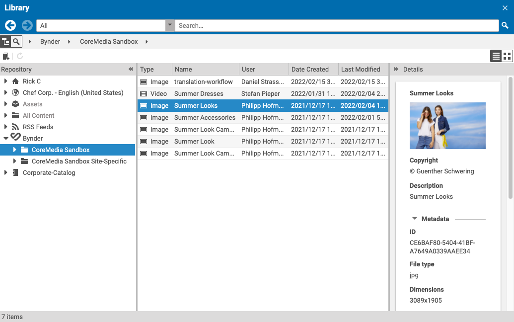

# Editorial Quick Start

--------------------------------------------------------------------------------

\[[Up](README.md)\] \[[Top](#top)\]

--------------------------------------------------------------------------------

## Table of contents

* [Introduction](#introduction)
* [Browsing the content-hub-adapter-bynder](#browsing-the-content-hub-adapter-bynder)
    * [Basic adapter configuration](#basic-adapter-configuration)
        * [Global adapter configuration](#global-adapter-configuration)
        * [Site-specific adapter configuration](#site-specific-adapter-configuration)
    * [Detailed adapter configuration](#detailed-adapter-configuration)
        * [Basic structure](#basic-structure)
        * [Bynder-specific configuration](#required-configuration)
        * [Multiple connections](#multiple-connections)
        * [Example](#example)     
* [Usage](#usage)    

## Introduction

As mentioned in the main documentation, the Content Hub Adapter for Bynder plugin
provides access to configurable Bynder accounts. Common to all
Content Hub Adapters is the appearance in CoreMedia Studio. The image below shows 
multiple configured Content Hub Adapters in Studio (a connection on Content Hub Adapter for Bynder is currently selected).

## Types of Content Working with This Adapter
- Images
  
Only image formats _JPEG_, _PNG_, and _GIF_ are supported.

Only files originally uploaded to Bynder are considered. Additional files and derivatives are not supported.

Other image formats or asset types will be shown but will produce an error when trying to import them.

## Configuring the Bynder Repository
Depending on the configuration of the adapter, the appearance of the tree may vary. The following sections 
take care of all configuration **places** and **options**.

### Basic Adapter Configuration
This section covers the two possibilities to enable the Content Hub Adapter for Bynder and configure on or more _connections_ on it. Please note that those
options are valid for all Content Hub Adapters. Before configuring the adapter, please refer to the documentation [Content Hub Configuration](https://documentation.coremedia.com/cmcc-10/artifacts/2104/webhelp/deployment-en/content/Studio-Contenthub-Configuration.html)
for preliminary steps.

#### Global Adapter Configuration
To enable the Content Hub Adapter for Bynder and associated connections for all sites, it is necessary to create a global _Settings_ document inside folder:
* _/Settings/Options/Settings/Content Hub/Connections/_
For convenience reasons, naming proposal of this document is "Bynder" (name of the third-party system)

#### Site-Specific Adapter Configuration
To enable the Content Hub Adapter for Bynder and associated connections for just a single site, it is necessary to create a _Settings_ document inside folder:
* _Options/Settings/Content Hub/Connections/_ (relative to the site's root folder)
For convenience reasons, naming proposal of this document is "Bynder" (name of the third-party system)

Site-specific configuration is valid for users that have this site set as their _Preferred Site_. Changing the _Preferred Site_ activates the corresponding site-specific configuration (and deactivates other site-specific configurations).

Global configuration will always be valid in addition to site-specific configuration.

### Detailed Adapter Configuration

#### Basic Structure
The table below shows the initial top-level entry for all Content Hub Adapter configurations.

| Key         | Type       | Required   |
|-------------|------------|------------|
| connections | StructList | Yes        |

After creation of the initial struct list **connections** the next step is to create the first entry. This can be done 
in Studio with the struct editor by pressing "_Add item to ListProperty_". Under this new item  basic settings are added. The table below shows the entries which are common for all connectors. _connectionId_ can be freely chosen (use only letters and digits) but must be unique and different from _all other_ Content Hub Adapter connections (be it Bynder or other third-party systems). 

| Key           | Type       | Value                 | Required   |
|---------------|------------|------------           |------------|
| connectionId  | String      | <SOME-UNIQUE-ID>     | Yes        |
| factoryId     | String      | bynder    | Yes        |
| enabled       | Boolean     | true or false        | Yes        |
| settings      | Struct     |                      | Yes        |
          

#### Bynder-Specific Configuration
Initially, struct _settings_ is empty.
The  struct  holds specific configuration options for the connector. Select struct _settings_ and click "_Add String_" for each entry.
The table below depicts all potential entries. 

| Key               | Type       | Description                                                    | Required   | 
|---------------    |------------|------------                                              |------------|
| displayName       | String     | Name of the connection's root folder to display in Studio             | No         |
| apiEndpoint         | String     | URL of Bynder REST API endpoint including API base path _(/api/v4/)_         | Yes         |
| accessToken            | String     | Access Token for Bynder account          | Yes         |

For the creation of Bynder access tokens, refer to Bynder support article [Permanent Tokens](https://support.bynder.com/hc/en-us/articles/360013875300).

#### Example
The image below shows a full configuration of the Content Hub Adapter for Bynder.

After changes or additions to adapter configurations, users may need to reload Studio in their browsers to see those new configurations.

## Multiple Connections

More than one connection can be configured, if required. Click "_Add item to ListProperty_" again on the _connections_ node in the settings and repeat configuration steps for the new connection. Mind to choose a new unique _connectionId_ and a recognizable _displayName_.

## Usage
Once the connector is configured, the "Bynder" named node appears in the library. By clicking on "Bynder",
the tree expands to all configured Bynder connections. Each connection folder shows the latest assets from the corresponding Bynder repository sorted by descending modification date. Search can be used to limit the results to the desired assets (see [Search](search)).

Folder contents are cached, so if new uploads to Bynder are missing, click button "_Reload Folder_" to update to the latest contents (red frame):

When an asset is selected, preview and detail information for the asset are available in the _Details_ section on the right-hand side. Only the currently active version of the asset will be considered here. If a newer version is available, you may need to click "_Reload Folder_" to be able to see its details (see above).

  

Assets can be imported into the CoreMedia CMS by selecting the desired asset and clicking button "_Create new content item_" (red frame):

  

The name of the newly created CoreMedia document will equal the asset's name.

Keep in mind that certain requirements on the connected Bynder account need to be met to allow download of full-size images to transfer them to the CoreMedia repository. See <https://bynder.docs.apiary.io/#reference/download/download-operations/retrieve-asset-download-location>. You may need to contact Bynder support to clarify settings for your Bynder account (refer to previous documentation URL for requirements when contacting Bynder support).

### Search

Assets can be search for by _Type_ and full-text search. Select a type to restrict search to from the drop-down list and enter asset _names_, _tags_, _keywords_, _author_, or _extensions_ (_jpg_, _png_, _gif_) in the text input field:

  
